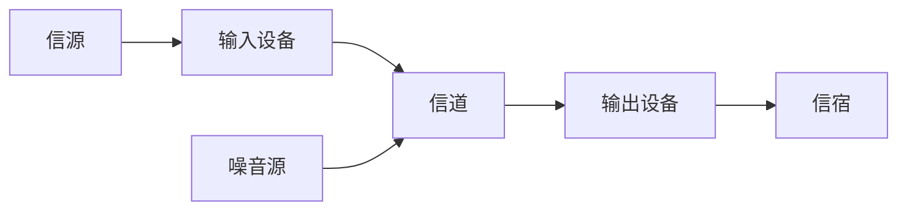

# 计算机网络结构

计算机网络是由自治的计算设备互联形成的结构. Internet是最大最典型的计算机网络.

## 硬件

计算机网络的硬件结构如下: 



这是一种抽象的模型.

对应到实际的网络中:

* 网络边缘: 主机(端系统)--信源

* 接入网络--输入/输出设备-信道

  * 家庭网络

    * 数字用户线路网络(DSL, 电话网络): 频分多路复用 独占网络 
    * 电缆网络(电视网络): 频分多路复用 共享网络 非对称

  * 机构网络

    * 以太网 --> 机构路由器 --> Internet

  * 无线网络

    通过共享的无线接入网络连接端系统与路由器, 通过基站(Base Station)或称为接入点(Access Point).

    * 无线局域网(LAN): WIFI
    * 广域无线接入: 运营商 蜂窝网

* 网络核心--输入/输出设备-信道

  互联的路由器网络, 主要提供路由和转发功能.

  ```mermaid
  graph LR
  	输入分组 --> 查询转发表 --> 确定分组到目的地的转发路径 --> 转发分组
  	运行路由算法 --> 查询转发表
  ```

  数据从源主机经由网络核心到目的主机是通过称为**数据交换**的过程完成的.

## 协议

网络协议由语法、语义以及时序三要素构成

## Internet网络结构

网络中心: 少数互连的大型网络

* 一级(tier-1)商业ISPs(如: 网通, 电信, Sprint, AT&T), 提供国家或国际范围的覆盖.
* 内容提供商网络(Content Provider Network): 私有网络, 连接其数据中心与Internet, 通常绕过一级ISP和区域ISPs.

IXP: Internet eXchange Point

## 数据交换

N^2^链路问题: N台主机互连所需链路数量为$\frac{N(N-1)}{2}$条，通过交换设备可以有效减少链路数量。

交换功能: 

* 动态转接
* 动态分配传输资源

类型:

* 电路交换: 最典型的电路交换网络——电话网络

  * 建立连接(呼叫/电路建立)
  * 通信
  * 释放连接(拆除电路)

  ==独占资源==

  中继线共享: 多路复用技术

* 报文交换