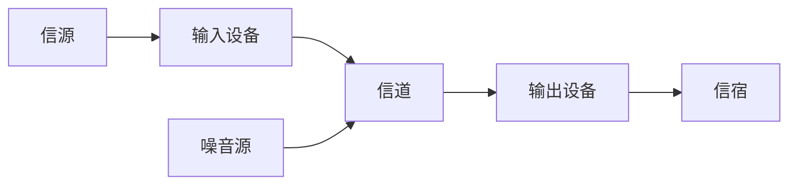
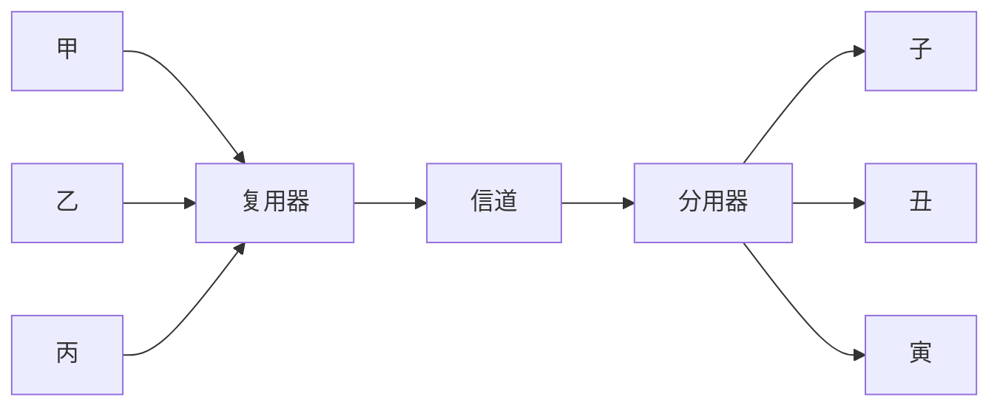
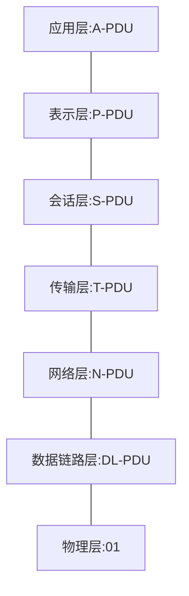

# 计算机网络结构

计算机网络是由自治的计算设备互联形成的结构. Internet是最大最典型的计算机网络.

## 硬件

计算机网络的硬件结构如下: 



这是一种抽象的模型.

对应到实际的网络中:

* 网络边缘: 主机(端系统)--信源

* 接入网络--输入/输出设备-信道

  * 家庭网络

    * 数字用户线路网络(DSL, 电话网络): 频分多路复用 独占网络 
    * 电缆网络(电视网络): 频分多路复用 共享网络 非对称

  * 机构网络

    * 以太网 --> 机构路由器 --> Internet

  * 无线网络

    通过共享的无线接入网络连接端系统与路由器, 通过基站(Base Station)或称为接入点(Access Point).

    * 无线局域网(LAN): WIFI
    * 广域无线接入: 运营商 蜂窝网

* 网络核心--输入/输出设备-信道

  互联的路由器网络, 主要提供路由和转发功能.

  ```mermaid
  graph LR
  	输入分组 --> 查询 --> 转发表 --> 确定分组到目的地的转发路径 --> 转发分组
  	运行路由算法 --> 创建 --> 转发表
  ```

  数据从源主机经由网络核心到目的主机是通过称为**数据交换**的过程完成的.

## 协议

网络协议由语法、语义以及时序三要素构成

## Internet网络结构

网络中心: 少数互连的大型网络

* 一级(tier-1)商业ISPs(如: 网通, 电信, Sprint, AT&T), 提供国家或国际范围的覆盖.
* 内容提供商网络(Content Provider Network): 私有网络, 连接其数据中心与Internet, 通常绕过一级ISP和区域ISPs.

IXP: Internet eXchange Point

## 数据交换

N^2^链路问题: N台主机互连所需链路数量为$\frac{N(N-1)}{2}$条，通过交换设备可以有效减少链路数量。

交换功能: 

* 动态转接
* 动态分配传输资源

类型:

### 电路交换

最典型的电路交换网络——电话网络

* 建立连接(呼叫/电路建立)
* 通信
* 释放连接(拆除电路)

==独占资源==

中继线共享: 多路复用技术

#### 多路复用技术




1. 频分多路复用(FDM): 将信道资源在频率上进行划分出子信道, 用户独占所分配到的子信道频带

2. 时分多路复用(TDM): 将时间划分为一段段等长的时分复用帧(TDM帧), 帧中划分时隙, 时隙周期性出现, 用户独占固定序号的时隙

3. 波分多路复用(WDM): 波分复用就是光的频分复用, 因为光通信系统中, 以光的波长进行划分(等效于对频率进行划分)

4. 码分多路复用(CDM): 广泛应用于无线链路共享(如蜂窝网, 卫星通信等). 每个用户分配一个唯一的`m bit`的码片序列, 其中"0"用"-1"表示, "1"用"+1"表示, 例如: $S_i = (-1 -1 -1 +1 +1 -1 +1 +1)$

   各用户使用相同频率载波, 利用各自分配的码片序列编码数据

   编码信号 = (原始数据) * (码片序列)

   ​	如发送二进制比特1, 则发送自己的码片序列

   ​	如发送二进制比特0, 则发送自己码片序列的反码

   各用户码片序列必须相互正交, 即满足: 
   $$
   \frac{1}{m}S_i\cdot S_j = \left\{
   \begin{aligned}
   1,\quad i = j\\
   0,\quad i \neq j
   \end{aligned}
   \right.
   \quad
   \frac{1}{m}S_i\cdot \overline{S_j} = \left\{
   \begin{aligned}
   -1,\quad i = j\\
   0,\quad i \neq j
   \end{aligned}
   \right.
   $$
   发送信号时, 所有用户的码片叠加一同传输, 设{di}为原始数据序列, 则各用户叠加向量为:
   $$
   P = \sum_{i = 1}^N d_i\cdot S_i
   $$
   

   解码时, 使用特定用户的码片序列对叠加数据求内积:
   $$
   \frac{1}{m}S_i\cdot P = \left\{
   \begin{aligned}
   1,&\quad S_i \in P\\
   -1,&\quad \overline{S_i} \in P\\
   0,&\quad S_i, \overline{S_i} \notin P
   \end{aligned}
   \right.
   $$

### 报文交换

**报文**: 源发送的信息整体

### 分组交换

**分组**: 报文拆分出的一系列相对较小的数据包, 由头部信息及数据组成

分组交换需要报文的拆分与重组, 并因此会产生额外的开销

#### 统计多路复用

链路的共享并非事先分配好的, 而是取决于不同源主机发送的分组数量多少

报文交换与分组交换均采用**存储-转发**交换方式, 区别在于报文交换以完整报文进行存储转发, 分组交换以小的分组为单位进行存储转发.

某分组从开始到发送完成的时间被称为传输时延


分组交换报文交付时间更短, 路由器所需的缓存空间更小.

报文交付时间可由下式计算: 
$$
\begin{aligned}
T &= \frac{M}{R} + (h-1)\frac{L}{R}\\
&= \frac{M}{R} + n\frac{L}{R}
\end{aligned}
$$

> 报文长度为 M bits
>
> 分组长度为 L bits
>
> 链路带宽为 R bits
>
> 跳数为 h
>
> 路由器数为 n


M = 980000 * 8 bits

R = 100 * 10^6 bits

L = 1000 * 8 bits

h = 3

n = 2

分组数980

M~实际~ = (980000 + 20 * 980) * 8 bits

= 7996800 bits

M/R = 0.079968

L/R = 8 * 10^-5

T = 0.079968 + 0.00016 = 0.080128 s = 80.128 ms

分组交换适用于突发数据传输网络:

* 资源充分共享
* 简单, 无需呼叫建立

可能产生拥塞:

* 分组延迟和丢失

## 计算机网络性能

### 速率

即数据率或称数据传输速率或比特率

​	单位时间(秒)传输信息(比特)量

​	速率往往是指额定速率或标称速率

### 带宽

在通信领域,带宽原本指信号具有的频带宽度, 即最高频率与最低频率之差, 单位是赫兹(Hz). 在计算机网络中的"带宽"指数字信道所能传输的"最高数据率", 单位是b/s(bps)

### 延迟/时延

分组因排队和传输过程而产生延迟. 路由器缓存满, 到达的分组会被丢弃--丢包.

分组延迟主要有四种:

1. d~proc~: 结点处理延迟(nodal processing delay)
   * 差错检测
   * 确定输出链路
   * 通常<msec
2. d~queue~: 排队延迟(queueing delay)
   * 等待输出链路可用
   * 取决于路由器拥塞情况
3. d~trans~: 传输延迟(transmission delay)
   * L: 分组长度(bits)
   * R: 链路带宽(bps)
   * d~trans~=L/R
4. d~prop~: 传播延迟(propagation delay)
   * d: 物理链路长度
   * s: 信号传播速度(~2 * 10^8m/sec, 典型铜缆电信号传播速度, 0.7c)
   * d~prop~=d/s

d~nodal~=d~proc~+d~queue~+d~trans~+d~prop~

**排队延迟**

R: 链路带宽(bps)

L: 分组长度(bits)

a: 平均分组到达速率

流量强度(traffic intensity) = La/R

La/R ~ 0: 平均排队延迟很小

La/R -> 1: 平均排队延迟很大

La/R > 1: 超出服务能力, 平均排队延迟无限大

### 时延带宽积

时延带宽积 = 传播时延(sec) * 带宽(bits/sec)

又称为以比特为单位的链路长度

### 分组丢失(丢包)

队列缓存容量有限

## 计算机网络体系结构

## 分层模型-开放系统互联(OSI)参考模型

理论成功, 商业失败的模型



中间系统无需实现的层次称为**端-端层**

**PDU**: 协议数据单元, 同层协议采用的数据传输单元

数据封装是为了增加控制信息, 从而构造协议数据单元. 控制信息主要包括: 

* 地址: 标识发送端/接收端
* 差错检测编码: 用于差错检测或纠正
* 协议控制: 实现协议功能的附加信息, 如: 优先级, 服务质量和安全控制等

### 物理层功能

**接口特性**: 机械特性, 电气特性, 功能特性, 规程特性

**比特编码**: 如何调制

**数据率**: 数据传输速度

**比特同步**: 确认收发同步, 时钟同步

**传输模式**: 

* 单工(Simplex): 只能单向通信
* 半双工(half-duplex): 交替完成双向通信
* 全双工(full-duplex): 双方可以同时进行双向通信

### 数据链路层功能

负责**结点-结点**的数据传输, 解决两相邻结点间数据的传输

以帧作为单位, 故需要**组帧**, 让另一数据链路层能够从物理层数据中对数据进行切分, 复原数据帧

**物理寻址**: 通过在帧头中增加发送端和/或接收端的物理地址标识数据帧的发送端和/或接收端(指明由谁进行接收)

**流量控制**: 避免淹没接收端

**差错控制**: 检测并重传损坏或丢失帧, 并避免重复帧

**访问(接入)控制**: 在任一给定时刻决定哪个设备拥有链路(物理介质)控制使用权

### 网络层功能

负责**源主机到目的主机数据分组交付**: 可能穿越多个网络

**逻辑寻址**: **全局唯一逻辑地址**, 确保分组能够送达目的主机

**路由**: 路径选择

**分组转发**

### 传输层功能

负责**源-目的(端-端)(进程间)**的完整**报文**传输

**分段与重组**

**SAP寻址**: 确保将完整的报文提交给正确进程

**连接控制**

**流量控制**

**差错控制**

